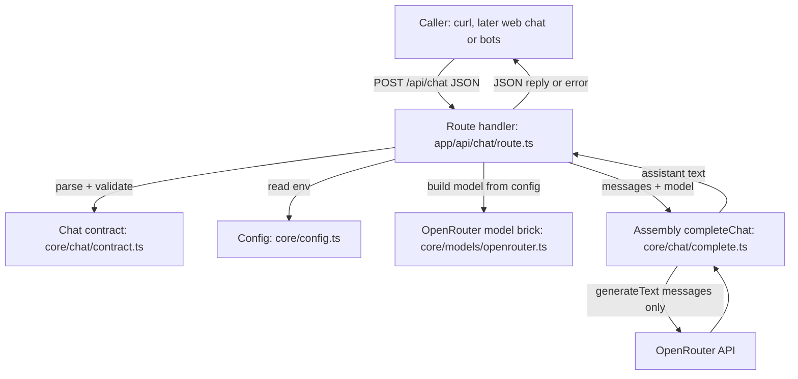
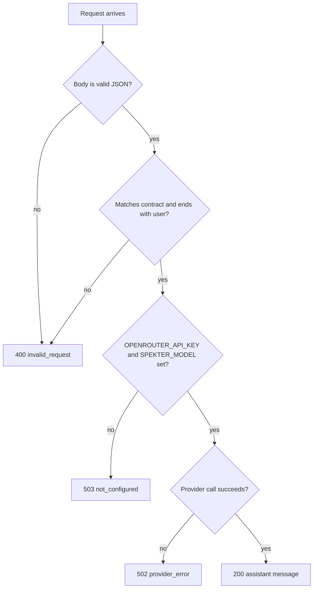

# Spekter Core Chat API - Plan

## Goal Capsule

- **Objective:** Filip can hold a multi-turn conversation with a real AI model through Spekter's own API from any client, starting with `curl`, without going through the web chat.
- **Means:** A framework-free core module that assembles the model call, exposed through one thin Next.js route handler (KTD1, KTD3).
- **Product authority:** This Product Contract, which scopes Linear ticket SPE-1 ("Create API endpoints for AI requests"), then `STRATEGY.md`. Streaming, web-chat wiring, MCP servers, `.md` knowledge, request logging (SPE-3), and messaging-bot interfaces are not active scope.
- **Implementation authority:** Product Contract wins on behavior; Planning Contract KTDs win on mechanism; Implementation Units override neither.
- **Stop conditions:** Stop and ask if the pinned OpenRouter provider cannot run against the installed `ai` v6, or if meeting a requirement would mean changing the web chat or adding persistence.
- **Execution profile:** Local single-developer change on a Next.js 16 app; no deployment, no migrations, no shared consumers.
- **Finisher:** `ce-work` (or Filip) implements and verifies; Filip runs the live `curl` check with his own OpenRouter key.
- **Open blockers:** None.

---

## Product Contract

### Summary

Spekter gets a standalone core API: a caller sends a conversation and receives the assistant's next reply as one complete message, generated by a single configured OpenRouter model.
Any interface can use it, and it has one clear place where instructions, `.md` knowledge, MCP tools, and an access gate can be added later.

### Problem Frame

Spekter is a single-user personal assistant for Filip.
Its long-term value is extensibility: connecting arbitrary MCP servers and giving the AI `.md` files to read, reachable from several interfaces (the web chat today; Telegram, Discord, or WhatsApp later).
Today no AI is wired in at all: the web chat answers every message with a hardcoded placeholder after a timer, and the AI SDK is installed but unused.
Because the project is open-ended, each piece needs to be easy to extend or strip back later, which rules out coupling the AI logic to the web page.

### Key Decisions

- **The API is a standalone core, not a backend for the web page.** Every interface talks to it the same way. (session-settled: user-directed — chosen over wiring the web chat to the model in this ticket: the API must stand on its own so more interfaces can be added easily.) Governs R5, R6.
- **Complete-reply endpoint now; streaming is a separate endpoint in a separate ticket.** (session-settled: user-directed — chosen over shipping both endpoints in SPE-1: SPE-1 sends the whole message, streaming follows in its own ticket.) Governs R1.
- **Stateless: the caller owns the conversation history.** (session-settled: user-directed — chosen over the API storing conversations by id and over single-message-only: least scope while still supporting follow-up questions; server-side memory can be its own ticket.) Governs R4.
- **One model, set in configuration.** (session-settled: user-directed — chosen over a per-request model override and over a UI model picker: simplest to change.) Governs R2.
- **No system prompt yet.** (session-settled: user-directed — chosen over an editable `.md` instructions file and over a constant in code: deferred.) Governs R3.
- **Local only, no access gate in SPE-1.** (session-settled: user-directed — chosen over deploying with a gate now: runs locally for now, with a clear place for a gate later.) Governs R10.
- **Failures surface as clear errors, never as a placeholder reply.** (session-settled: user-approved — proposed in the scope synthesis and confirmed.) Governs R7.

### Requirements

**Conversation reply**

- R1. A caller sends a conversation (an ordered list of user and assistant messages) and receives the assistant's next reply as one complete message.
- R2. The reply comes from a single model named in configuration; switching models requires changing only that configuration value.
- R3. The model receives only the caller's conversation, with no system prompt or added instructions.
- R4. The API keeps nothing between requests; each request carries the full history it wants the model to see.

**Interface independence**

- R5. The API is callable over HTTP by any client without the web chat running or being involved; `curl` is the first supported client.
- R6. The request and reply contract contains nothing specific to the web chat, so a messaging-bot interface could use it unchanged.

**Failure behavior**

- R7. When the OpenRouter key is missing or the provider call fails, the caller receives an error that is clearly distinguishable from a reply and says what went wrong.
- R8. A request with no messages or with malformed messages is rejected with a clear error instead of being sent to the model.

**Room to grow**

- R9. Model, instructions, context, and tools are brought together in one place, so a system prompt, `.md` knowledge, and MCP tools can each be added there later without changing the contract callers use.
- R10. An access check can later be added in one place that covers every caller, without changing any interface.

### Key Flows

Omitted: SPE-1 is a single request-and-reply API surface with no multi-step behavior; the Requirements and Acceptance Examples cover every path.

### Acceptance Examples

- AE1. Multi-turn reply
  - **Covers:** R1, R4, R5
  - **Given:** The API is running locally with a valid OpenRouter key.
  - **When:** Filip sends, via `curl`, a conversation of a user message, an assistant reply, and a follow-up user question that depends on the first message.
  - **Then:** He receives one complete assistant reply that answers the follow-up in context.
- AE2. Missing key
  - **Covers:** R7
  - **Given:** No OpenRouter key is configured.
  - **When:** Any valid conversation is sent.
  - **Then:** The caller receives an error stating the provider is not configured, not a reply.
- AE3. Empty conversation
  - **Covers:** R8
  - **Given:** The API is running with a valid key.
  - **When:** A request with an empty message list is sent.
  - **Then:** The caller receives a validation error and no model call is made.

### Scope Boundaries

- Streaming reply endpoint (separate ticket, powers SPE-2).
- Connecting the web chat to the API; the web chat keeps its placeholder reply until SPE-2.
- Server-side conversation storage or memory.
- System prompt or Spekter persona; the model may introduce itself under its own name.
- Per-request model choice or a model picker.
- MCP server connections and `.md` knowledge files.
- Access gate, authentication, and deployment.
- Telegram, Discord, WhatsApp, or any other interface.

<!-- ce-section: work-relationships -->
### How This Work Fits Together

This plan covers only the core complete-reply API (SPE-1). The broader breakdown below is the current understanding, not a committed roadmap.

- Streaming reply endpoint — Depends on this plan's contract; Enables SPE-2.
  - SPE-2, stream replies into the web chat's assistant bubbles — Depends on the streaming endpoint.
- System prompt / Spekter instructions — Depends on R9's single assembly point; Still to decide where instructions live.
- `.md` knowledge files — Depends on R9; Shares the assembly point with instructions.
- MCP server connections — Depends on R9.
- Access gate and deployment — Depends on R10; a prerequisite of any messaging-bot interface, since bots reach the API over the internet.
  - Telegram, Discord, WhatsApp interfaces — Depend on the access gate and deployment; may later want server-side conversation memory (still to decide).

### Dependencies / Assumptions

- Filip has an OpenRouter account and API key available to put in local configuration.
- The installed AI SDK (`ai` v6 in `package.json`) is the intended way to call the model, per SPE-1's description; no OpenRouter provider package is installed yet.
- No API routes, persistence, or auth exist today (`src/app/` contains only `layout.tsx`, `page.tsx`, and styles), so this work adds the first server endpoint.

### Outstanding Questions

All questions deferred to planning are resolved in the Planning Contract: the OpenRouter integration (KTD2), the request and reply shape (KTD3), the initial model (KTD5), and requiring the last message to be the user's (KTD7).

### Sources / Research

- Linear SPE-1: "Add OpenRouter request to an API endpoints using the AI SDK."
- Linear SPE-2: "Stream API responses as an \"assistant\" message to the ChatInterface."
- `src/components/chat/ChatInterface.tsx` — current placeholder reply via timer; the web chat holds conversation history in local state.
- `src/components/chat/types.ts` — current chat message shape (`id`, `role`, `content`, `createdAt`).
- `STRATEGY.md` — Lego positioning (small owned core, swappable bricks), "the core stays able to run headless" boundary, Backend track.

---

## Planning Contract

**Product Contract preservation:** restructured, no scope change: Outstanding Questions resolved by KTD2, KTD3, KTD5, KTD7; Goal Capsule extended with means, authority, and stop conditions.

### Key Technical Decisions

- KTD1. **The core lives in `src/core/` and imports nothing from Next.js.** The route handler in `src/app/api/chat/route.ts` only translates HTTP to core calls and core results back to HTTP. This keeps the core runnable headless and reusable by a future bot process or streaming route, per the `STRATEGY.md` Lego positioning. Governs R5, R6, R9.
- KTD2. **OpenRouter through `@openrouter/ai-sdk-provider`, pinned to the 2.x line (`^2.10.0`).** 2.x declares peer `ai ^6.0.0`, matching the installed `ai` 6.0.297; 3.x requires `ai ^7`, and upgrading the AI SDK is out of scope. The generic `@ai-sdk/openai-compatible` adapter was rejected because the official provider is maintained against OpenRouter's API and is itself one swappable brick. 2.10.0 was published 2026-06-26, well past the 7-day vetting window. Governs R2.
- KTD3. **Contract: `POST /api/chat` with a plain-text message list; reply is one assistant message.** Request body is `{ messages: [{ role: "user" | "assistant", content: string }] }`. Success body is `{ message: { role: "assistant", content }, model }`. Error body is `{ error: { code, message } }`. The shape deliberately is not the AI SDK UI message format, which is tied to `useChat` and the web chat. A future streaming endpoint is a sibling route that reuses the same request contract and assembly function. (session-settled: user-directed — chosen over the API storing conversations by id and over single-message-only: least scope while still supporting follow-up questions.) Governs R1, R4, R6.
- KTD4. **One assembly function owns the model call, with the model passed in.** A core `completeChat` function receives validated messages and a language model, calls `generateText` with `messages` only, and returns the assistant text. A system prompt, `.md` context, and MCP tools are added inside this function later; tests pass a mock model. Governs R3, R9.
- KTD5. **Configuration comes from two required environment variables, read per request.** `OPENROUTER_API_KEY` and `SPEKTER_MODEL` (an OpenRouter model id) are checked before any provider call; a missing value raises a configuration error naming the variable. Reading per request, not at module load, keeps `next dev` and `next build` working without a key. `.env.example` suggests a starting model id; Filip picks the actual model in `.env.local`. (session-settled: user-directed — chosen over a per-request model override and over a UI model picker: simplest to change.) Governs R2, R7.
- KTD6. **Errors map to HTTP statuses by kind.** Invalid JSON or schema failures return 400 `invalid_request`. Missing configuration returns 503 `not_configured`. Any failure from the provider call returns 502 `provider_error` with the provider's message. Anything unexpected returns 500 `internal_error`. Success bodies carry `message` and error bodies carry `error`, so the two never look alike. Governs R7, R8.
- KTD7. **A conversation must contain at least one message and end with a user message.** Roles are limited to `user` and `assistant`, content must be a non-empty string, and a conversation ending in an assistant message is rejected as invalid. Validation uses `zod` (already a dependency) and runs before configuration or model access. Governs R1, R3, R8.
- KTD8. **The future access gate is a `src/proxy.ts` file; nothing is built now.** Next.js 16 runs `proxy` (the renamed middleware) before every matched route, so one file can later gate all `/api/*` routes without touching handlers or interfaces. Governs R10.
- KTD9. **Tests use Vitest 4.x in a Node environment with a mocked model.** Vitest 5 requires Node `^22.12`, while this machine runs Node 20.17; 4.1.11 supports Node 20 and was published 2026-08-18. Model behavior is simulated with `MockLanguageModelV3` from `ai/test`, so no test makes a network call or spends credits.
- KTD10. **The dev and start servers bind to `127.0.0.1`.** Next.js binds to `0.0.0.0` by default (`node_modules/next/dist/docs/01-app/03-api-reference/06-cli/next.md`), which would let any device on the same network call the unauthenticated endpoint and spend OpenRouter credits. Binding to localhost is what makes the "local only, no access gate" decision true until the gate in KTD8 exists. Governs R10.

### High-Level Technical Design

Request flow across the adapter, core, and provider:



Error mapping decisions, checked in this order so a bad request never touches configuration or the provider:



### Assumptions

- `@openrouter/ai-sdk-provider` 2.x works with `ai` 6.0.297 at runtime, as its peer range states; the stop condition in the Goal Capsule covers the case where it does not.
- `generateText`'s default retry behavior (2 retries) is acceptable; a failure after retries surfaces as a 502.

### Output Structure

```text
src/
  core/
    config.ts
    config.test.ts
    errors.ts
    models/
      openrouter.ts
    chat/
      contract.ts
      contract.test.ts
      complete.ts
      complete.test.ts
  app/
    api/
      chat/
        route.ts
        route.test.ts
vitest.config.mts
.env.example
```

### Scope Boundaries (planning)

Considered and not built:

- Request timeout beyond the SDK defaults — a hang is visible immediately to the single local caller; revisit when a bot interface calls the API unattended.
- `server-only` import guards on core files — the API key has no `NEXT_PUBLIC_` prefix, so Next.js never inlines it into client bundles; revisit if core code starts being imported by client components.
- Request body size limits and rate limiting — local single-user use only; these belong with the access gate before deployment.

### Deferred to Follow-Up Work

- Request latency and success-rate logging — Linear SPE-3, which hooks into the route/assembly boundary defined here.
- Streaming endpoint reusing KTD3's contract and KTD4's assembly function.
- Upgrading to `ai` v7 and `@openrouter/ai-sdk-provider` 3.x.

### Risks & Dependencies

- **Version pin under churn:** the provider's current major (3.x) has moved to `ai` v7, so 2.x will receive fewer fixes. The pin is explicit in `package.json` and called out in KTD2, so a later upgrade is a deliberate swap.
- **External API:** OpenRouter errors, rate limits, and model availability are outside Spekter's control; KTD6 surfaces them as 502 with the provider's message.

### Sources & Research

- `node_modules/next/dist/docs/01-app/03-api-reference/03-file-conventions/route.md` — Route Handlers use Web `Request`/`Response`, `POST` export, `Response.json`.
- `node_modules/next/dist/docs/01-app/03-api-reference/03-file-conventions/proxy.md` — `middleware` is renamed `proxy` in this Next.js version (KTD8).
- `node_modules/next/dist/docs/01-app/02-guides/testing/vitest.md` — Vitest setup guidance for this Next.js version.
- `node_modules/next/dist/docs/01-app/03-api-reference/06-cli/next.md` — `next dev` / `next start` default hostname is `0.0.0.0` (KTD10).
- `node_modules/ai/dist/index.d.ts` — `generateText` accepts `messages`, `maxRetries` (default 2); `APICallError` and `RetryError` are exported.
- `node_modules/ai/dist/test` — exports `MockLanguageModelV3` for tests (KTD9).
- npm registry: `@openrouter/ai-sdk-provider@2.10.0` peer `ai ^6.0.0`; `3.x` peer `ai ^7.0.0`; `vitest@5` engines `node ^22.12.0`; `vitest@4.1.11` engines include Node 20.
- AI SDK OpenRouter provider docs: https://ai-sdk.dev/v6/providers/community-providers/openrouter

---

## Implementation Units

### U1. Test harness

**Goal:** The repo can run unit tests in a Node environment with the `@/` path alias.

**Requirements:** Supports verification of R1–R9.

**Dependencies:** None.

**Files:**
- `package.json` (add `vitest` 4.x dev dependency and a non-watch `test` script)
- `vitest.config.mts` (create)

**Approach:**
1. Add Vitest 4.x as a dev dependency (KTD9).
2. Configure the Node test environment and map `@/` to `src/` to match `tsconfig.json` paths, without React or jsdom plugins.
3. Add a `test` script that runs once and exits, so it works in verification and future CI.

**Patterns to follow:** `node_modules/next/dist/docs/01-app/02-guides/testing/vitest.md`, minus the React Testing Library parts.

**Test scenarios:** Test expectation: none -- scaffolding; U2's tests are the first proof that the harness runs.

**Verification:** The test command runs and reports no test files without erroring on configuration.

### U2. Core configuration, errors, and OpenRouter model brick

**Goal:** The core can read its configuration and build an OpenRouter language model, and has typed errors for every failure kind.

**Requirements:** R2, R7.

**Dependencies:** U1.

**Files:**
- `package.json` (add `@openrouter/ai-sdk-provider` `^2.10.0`)
- `src/core/errors.ts` (create)
- `src/core/config.ts` (create)
- `src/core/models/openrouter.ts` (create)
- `src/core/config.test.ts` (create)

**Approach:**
1. Define three error types matching KTD6's codes: invalid request, not configured, and provider error.
2. A config reader returns the API key and model id from the environment, raising the not-configured error that names each missing variable (KTD5).
3. The OpenRouter brick takes the config and returns an AI SDK language model for the configured model id (KTD2). It is the only file that imports the provider package.

**Patterns to follow:** None in repo yet; this sets the core's file conventions.

**Test scenarios:**
- With both variables set, the config reader returns the key and model id.
- With `OPENROUTER_API_KEY` unset, it raises the not-configured error naming that variable.
- With `SPEKTER_MODEL` unset, it raises the not-configured error naming that variable.
- With a variable set to an empty string, it is treated as missing.

**Verification:** Config tests pass; the provider package resolves without peer-dependency errors against `ai` v6.

### U3. Chat contract and assembly function

**Goal:** The core validates a conversation and turns it into one assistant reply through a single assembly function.

**Requirements:** R1, R3, R4, R8, R9; Key Decisions governing R1, R3, R4.

**Dependencies:** U2.

**Files:**
- `src/core/chat/contract.ts` (create)
- `src/core/chat/complete.ts` (create)
- `src/core/chat/contract.test.ts` (create)
- `src/core/chat/complete.test.ts` (create)

**Approach:**
1. The contract module defines the request schema and the request/response types from KTD3, with the validation rules of KTD7.
2. `completeChat` takes validated messages and a language model, calls `generateText` with those messages and no `system`, `tools`, or extra settings, and returns the assistant text (KTD4).
3. Any error thrown by the model call is wrapped in the provider error carrying the original message (KTD6).
4. No module-level state; every call works only from its arguments (R4).

**Execution note:** Implement test-first; the assembly function is the brick later work extends, so its contract should be pinned by tests before code.

**Test scenarios:**
- A conversation of user, assistant, user passes validation unchanged.
- An empty message list fails validation. Covers AE3.
- A missing `messages` field fails validation.
- A message with role `system` fails validation.
- A message with empty-string content fails validation.
- A conversation ending with an assistant message fails validation.
- `completeChat` with a mock model returning "Hello" returns "Hello".
- `completeChat` passes the caller's messages to the model in order and sends no system prompt or tools.
- `completeChat` with a mock model that throws returns a provider error carrying the thrown message.
- Two sequential `completeChat` calls with different conversations do not see each other's messages.

**Verification:** Contract and assembly tests pass with no network access.

### U4. HTTP route handler

**Goal:** `POST /api/chat` accepts a conversation over HTTP and returns the complete assistant reply or a clear error.

**Requirements:** R1, R5, R6, R7, R8; AE1, AE2, AE3.

**Dependencies:** U3.

**Files:**
- `src/app/api/chat/route.ts` (create)
- `src/app/api/chat/route.test.ts` (create)

**Approach:**
1. Export only `POST`; Next.js answers other methods automatically.
2. Parse the JSON body, validate it with the contract, read config, build the model through the OpenRouter brick, and call `completeChat`, in the order shown in the error-mapping diagram.
3. Translate the core's error types to statuses and bodies per KTD6.
4. The handler holds no business logic beyond this translation (KTD1).

**Patterns to follow:** `node_modules/next/dist/docs/01-app/03-api-reference/03-file-conventions/route.md` (Request Body, `Response.json`).

**Test scenarios:**
- Covers AE1. A valid three-message conversation with config set and the model brick mocked returns 200 with an assistant message and the configured model id.
- Covers AE2. A valid conversation with `OPENROUTER_API_KEY` unset returns 503 `not_configured`, and the model is never called.
- Covers AE3. An empty message list returns 400 `invalid_request`, and the model is never called.
- A body that is not JSON returns 400 `invalid_request`.
- A conversation ending with an assistant message returns 400 `invalid_request`.
- A model failure returns 502 `provider_error` with the provider's message.
- Success responses contain `message` and no `error`; error responses contain `error` and no `message`.

**Verification:** Route tests pass; with `npm run dev` running, a `curl` POST without a key returns the 503 body.

### U5. Local configuration and usage docs

**Goal:** Filip can configure the key and model and call the API with `curl` from the README alone.

**Requirements:** R2, R5, R10.

**Dependencies:** U4.

**Files:**
- `package.json` (bind `dev` and `start` scripts to `127.0.0.1`, per KTD10)
- `.env.example` (create)
- `.gitignore` (add an exception so `.env.example` is tracked while other `.env*` files stay ignored)
- `README.md` (replace the create-next-app boilerplate with a short "Core chat API" section)

**Approach:**
1. Bind the `dev` and `start` scripts to `127.0.0.1` (KTD10).
2. `.env.example` lists `OPENROUTER_API_KEY` (empty) and `SPEKTER_MODEL` with a suggested current OpenRouter model id.
3. The README explains copying it to `.env.local`, starting the dev server, and one `curl` example with a multi-turn conversation, plus the three error codes.

**Test scenarios:** Test expectation: none -- configuration and documentation only.

**Verification:** `git status` shows `.env.example` as trackable and `.env.local` as ignored; the dev server reports listening on `127.0.0.1`; following the README with a real key reproduces AE1.

---

## Verification Contract

| Gate | Command | Applies to | Done signal |
| --- | --- | --- | --- |
| Unit tests | `npm run test` | U2, U3, U4 | All tests pass, no network calls |
| Lint | `npm run lint` | All units | No errors |
| Types | `npx tsc --noEmit` | All units | No errors |
| Build | `npm run build` | All units | Build succeeds with no `.env.local` present |
| Live check | `npm run dev`, then the README `curl` example | U4, U5 | AE1 reproduced with Filip's key; AE2 reproduced without it |

The live check needs Filip's OpenRouter key and is run by him; every other gate runs without credentials.

---

## Definition of Done

- R1–R10 are met: R10 and the R9 extension points are satisfied by structure (KTD4, KTD8), the rest by tests and the live check.
- AE1, AE2, and AE3 each have a passing route test, and AE1 has been reproduced live with `curl`.
- All Verification Contract gates pass.
- The web chat (`src/components/chat/`, `src/app/page.tsx`) is unchanged.
- No secrets are committed; `.env.local` stays ignored.
- The API is reachable only from this machine (KTD10).
- No abandoned-attempt code, unused dependencies, or commented-out experiments remain in the diff.
- Per unit: each unit's Verification line holds.
