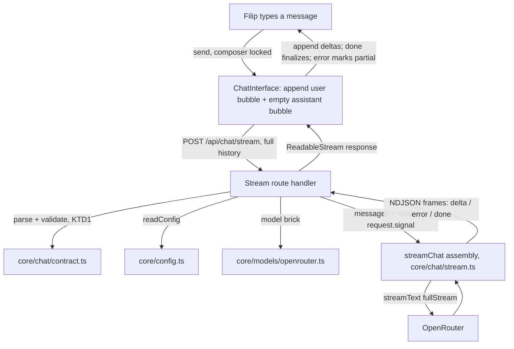
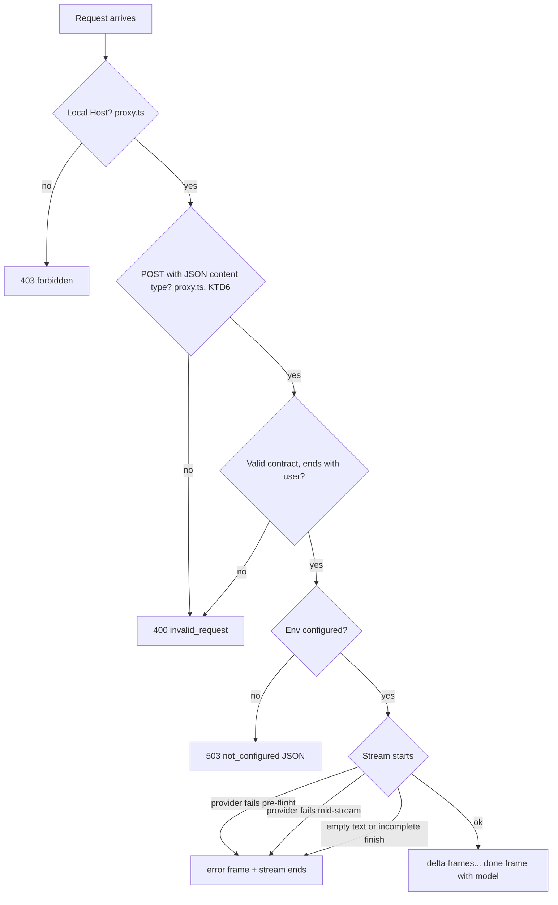

# Streamed Assistant Bubbles - Plan

## Goal Capsule

- **Objective:** Filip sends a message in the web chat and watches Spekter's real reply grow in an assistant bubble, and any client — `curl` included — can stream the same reply from the core API.
- **Means:** A framed NDJSON streaming sibling of `POST /api/chat` built on `streamText`'s `fullStream`, plus hand-written fetch-stream wiring in `ChatInterface` (KTD1, KTD2, KTD3, KTD5).
- **Product authority:** Linear SPE-2 ("Stream message in text bubbles") and SPE-4 ("Core streaming reply endpoint"), then the SPE-1 plan's decisions, then `STRATEGY.md`. Server-side memory, tools, `.md` knowledge, request logging (SPE-3), and other interfaces are not active scope.
- **Implementation authority:** Product Contract wins on behavior; Planning Contract KTDs win on mechanism; Implementation Units override neither.
- **Stop conditions:** Stop and ask if `streamText`'s `fullStream` cannot run against the installed `@openrouter/ai-sdk-provider` 2.x at runtime, or if honest mid-stream error signaling would require changing SPE-1's complete-reply contract (it should not).
- **Execution profile:** Local single-developer change on a Next.js 16 app; no deployment, no migrations, no shared consumers.
- **Finisher:** `ce-work` (or Filip) implements and verifies; Filip runs the live `curl` and browser checks with his own OpenRouter key.
- **Open blockers:** None. (SPE-4 was folded into this plan — see Key Decisions.)

---

## Product Contract

### Summary

Spekter's web chat streams real model replies into assistant bubbles instead of showing a hardcoded placeholder, and the core gains a streaming endpoint next to the complete-reply one so every interface gets the same streamed reply.

### Problem Frame

Today every message sent in the web chat is answered by a hardcoded placeholder after a 700 ms timer (`src/components/chat/ChatInterface.tsx`) — the interface Filip actually uses cannot talk to the AI.
SPE-1 deliberately kept the web chat on that placeholder and left both streaming and web-chat wiring out of scope, so there is a working core API with no streamed variant and a UI that never calls it.
Streaming is the interface behavior that matters for a chat, and the SPE-1 plan pinned streaming to "a sibling route that reuses the same request contract and assembly function," which this plan executes.

### Key Decisions

- **This plan covers both the streaming endpoint and the web-chat wiring.** (session-settled: user-directed — chosen over planning the web chat alone against an unbuilt endpoint: SPE-2's outcome cannot be shown working without the endpoint, and both are small.) Governs R1, R6.
- **The wire contract stays plain, not the AI SDK UI-message format.** (session-settled: user-approved — proposed in the scoping synthesis and confirmed.) This extends SPE-1 KTD3's reasoning to the streamed reply: the endpoint must be curl-callable and interface-agnostic. Governs R2, R4.
- **A reply that fails mid-stream keeps its partial text, marked as failed, and never gets error text posing as a completed reply.** (session-settled: user-approved — proposed in the scoping synthesis and confirmed.) Extends the SPE-1 rule that failures surface as clear errors, never as placeholder replies. Governs R5, R9.

### Requirements

**Streaming endpoint**

- R1. `POST /api/chat/stream` accepts exactly the conversation contract of `POST /api/chat` — same body shape, same validation rules, same error codes for invalid input.
- R2. A valid request receives the assistant reply incrementally as the model generates it.
- R3. The streamed reply ends with an explicit completion signal carrying the configured model id.
- R4. Errors are distinguishable from reply content: failures known before the stream starts keep SPE-1's JSON error contract, and a failure during generation arrives as an error frame, never as truncated text.
- R5. The streaming and complete endpoints call the model through one shared assembly point, so a later change to model, instructions, context, or tools applies to both.

**Web chat**

- R6. Sending a message creates an assistant bubble that grows as the streamed reply arrives and ends as an ordinary completed reply.
- R7. The web chat sends the full client-held conversation with every message, so follow-up questions keep prior context.
- R8. While a reply is in flight, the composer stays disabled, as it is today.
- R9. Chat failures — missing key, provider failure, bad request, mid-stream break, client-side connection loss — surface as a visible error state, and the hardcoded placeholder reply is gone.

### Acceptance Examples

- AE1. Live multi-turn streaming in the browser
  - **Covers:** R6, R7, R8, R9
  - **Given:** The app is configured with a valid OpenRouter key and at least one prior exchange.
  - **When:** Filip sends a follow-up question that depends on the earlier exchange.
  - **Then:** An assistant bubble appears and grows word-by-word until it holds the complete answer, which uses the earlier context; the composer is locked until the reply completes.
- AE2. Streaming from curl
  - **Covers:** R1, R2, R3
  - **Given:** The app is running with a valid key.
  - **When:** Filip POSTs a multi-turn conversation to the streaming route with buffering off.
  - **Then:** Reply text arrives incrementally and the stream ends with a completion signal naming the configured model.
- AE3. Missing key on the streaming route
  - **Covers:** R4
  - **Given:** No OpenRouter key is configured.
  - **When:** A valid conversation is POSTed to the streaming route.
  - **Then:** The caller receives the same 503 `not_configured` JSON error as the complete endpoint, and no model call is made.
- AE4. Provider failure mid-stream
  - **Covers:** R4, R9; Key Decision on partial text
  - **Given:** The provider stops functioning after some reply text was already delivered.
  - **When:** That failure occurs.
  - **Then:** `curl` receives an error frame naming the failure, and the web chat keeps the partial text with a visible error marker instead of completing it as a reply.
- AE5. Invalid input on the streaming route
  - **Covers:** R1
  - **Given:** Any configuration state.
  - **When:** A request with an empty or malformed message list is POSTed to the streaming route.
  - **Then:** The caller receives the same 400 `invalid_request` body as the complete endpoint, and no model call is made.

### Scope Boundaries

- Server-side conversation storage or memory (SPE-15).
- System prompt, `.md` knowledge, MCP tools, agent loops — the shared assembly point (R5) is where they attach later.
- Markdown rendering, stop/regenerate buttons, and other presentation polish, per `STRATEGY.md`'s "UX and UI polish come after speed, reliability and room to experiment."
- Request latency and success-rate logging (SPE-3), which hooks the route/assembly boundary this plan defines.
- Access gate beyond the existing local-only checks; deployment (SPE-20).

**Considered and not built:**

- Stream resume / reconnect after a dropped connection — the frozen reply is immediately visible to its only user, and re-sending is cheap; revisit when unattended clients (bots) consume the stream.
- An explicit client-side stop button — UI polish; closing or navigating away already cancels the stream (KTD4).
- Render-side token batching — per-delta rendering is untested only if jank shows up in the live check; add then, not before.

#### Deferred to Follow-Up Work

- SPE-3 request logging at the route/assembly boundary, now on both endpoints.
- Adopting the AI SDK UI-message stream and `useChat` if the contract ever needs parts (files, tools, reasoning) — a deliberate later swap, as with the SPE-1 provider pin.

### Dependencies / Assumptions

- SPE-1 is merged and present: `src/core/` (config, errors, contract, complete, OpenRouter brick, mocks) and `src/app/api/chat/route.ts` exist.
- Filip has a valid OpenRouter key in local configuration.
- `@openrouter/ai-sdk-provider` 2.10.0 implements streaming (`doStream`) compatible with `ai` 6.0.297's `streamText`; verified from the installed packages. The Goal Capsule stop condition covers a runtime surprise.

### Outstanding Questions

None.

### Sources / Research

- Linear SPE-2: "Stream API responses as an "assistant" message to the ChatInterface."
- Linear SPE-4: "Core streaming reply endpoint" — acceptance criteria folded into this plan.
- `docs/plans/2026-09-30-1257-feat-core-chat-api-plan.md` — SPE-1 KTD3 (stream endpoint is a sibling route reusing the contract and assembly function), KTD5–KTD7 (config, error mapping, validation), and the deferred item this plan picks up.
- `docs/solutions/security-issues/local-api-reachable-from-browser-pages.md` — every new API route must keep the JSON content-type gate; never add CORS headers.
- `STRATEGY.md` — Interfaces track (web chat is one client among many), UX-polish boundary.
- `node_modules/ai/dist/index.d.ts` — `streamText` result exposes `textStream` (deltas only, errors swallowed), `fullStream` (incl. `error` parts), and `abortSignal` call setting (KTD2, KTD4).
- `node_modules/next/dist/docs/01-app/03-api-reference/03-file-conventions/route.md` — route handlers stream by returning `new Response(readableStream)`.
- `node_modules/ai/dist/test/index.d.ts` — `MockLanguageModelV3` supports `doStream` and records `doStreamCalls` (KTD7).

---

## Planning Contract

### Key Technical Decisions

- KTD1. **The streaming endpoint is the sibling route `src/app/api/chat/stream/route.ts`, exactly as SPE-1 KTD3 reserved.** Same request contract and validation as `POST /api/chat`, same `ErrorCode` → status mapping for failures known before the stream starts. Governs R1–R4.
- KTD2. **The wire format is NDJSON: one JSON object per line, `Content-Type: application/x-ndjson`.** Frames are `{ type: "delta", text }`, `{ type: "error", code, message }`, and `{ type: "done", model }`. Chosen over Server-Sent Events (equal curl readability; `EventSource` cannot POST, so the client must parse a fetched stream either way, and NDJSON drops the `data:`/blank-line ceremony) and over the SDK's UI-message stream (`toUIMessageStreamResponse` would bind the core contract to the AI SDK's format — the same reason SPE-1 KTD3 rejected it; the plain contract keeps every future interface free of the SDK). Plain text was rejected outright: `textStream` swallows error parts, so a mid-stream failure would be indistinguishable from a truncated reply, violating R4. (session-settled: user-approved — see Key Decisions.) Governs R2–R4.
- KTD3. **Server framing comes from `streamText(...).fullStream`, translated by a shared core function.** A `streamChat` assembly in `src/core/chat/` maps `text-delta` parts to delta frames, `error` parts to error frames, the final `finish` part to the done frame, and — because KTD4 makes aborts routine — an `abort` part to a silent end of stream with neither an error frame nor a done frame — applying the same completeness rules as `completeChat` (empty total text or a `content-filter`/`error`/`other` finish reason becomes an error frame, never a done frame; `length` still delivers the streamed text). Both `completeChat` and `streamChat` go through one seam where system prompt, knowledge, and tools attach later (R5). Governs R2, R4, R5.
- KTD4. **Client disconnects cancel the provider call.** The route passes `request.signal` through as `streamText`'s `abortSignal`, so closing the tab or cancelling the fetch stops the OpenRouter call and its spend. Governs R2; informed by `ai`'s `CallSettings.abortSignal`.
- KTD5. **The web chat reads the stream by hand — no `useChat`.** Frame parsing lives in a React-free module under `src/components/chat/` (fetch wrapper + incremental line parser), covered by Node-environment tests; `ChatInterface` keeps only state glue. Manual reading is what the plain NDJSON contract (KTD2) makes cheap; `@ai-sdk/react`'s `useChat` expects the SDK's UI-message protocol, which KTD2 excludes. (session-settled: user-approved — see Key Decisions.) Governs R6, R9.
- KTD6. **The JSON content-type gate moves from the chat route into `src/proxy.ts`.** There are now two API routes; the security learning anticipated exactly this ("copy the check … or move it into src/proxy.ts once there is more than one route" — `docs/solutions/security-issues/local-api-reachable-from-browser-pages.md`). The check applies to `POST` under `/api/*` so one gate covers every present and future route; the chat route drops its own copy. No CORS headers are added anywhere. Governs R1.
- KTD7. **Tests reuse and extend the existing mock-model seam.** `src/core/testing/mock-model.ts` gains a streaming mock via `MockLanguageModelV3`'s `doStream`, so every streaming path is tested with no network and no credits. Client-side parsing is tested in the Node environment against synthetic `ReadableStream`s; React glue stays untested by unit tests and is exercised by the live browser check.

### High-Level Technical Design

Reply flow across interface, route, core, and provider:

Failure routing, in order, so a bad request never touches configuration or the provider:

### Assumptions

- Streaming over plain HTTP on the local dev server is not buffered by Next.js between the route handler and fetch; the live curl check (Verification Contract) is the proof.
- `request.signal` aborts reliably in the Next.js 16 route-handler runtime; the abort path is verified by tests against the route handler rather than live.
- Message ids keep the current `role-timestamp` shape; the assistant bubble's `createdAt` is the moment the bubble is created (stream start), so ordering needs no new state.

### Scope Boundaries (planning)

Considered and not built, beyond the Product Contract's non-goals:

- Buffering or coalescing deltas server-side — the SDK already emits provider chunks; an extra hop adds lag without any observed need.
- A shared `fetch`/`EventSource` client library for future interfaces — the parse module under `src/components/chat/` is deliberately small; generalize when a second interface exists.
- Hardening against interrupted revalidation of the conversation (editing or deleting sent messages) — out of SPE-2 entirely.

### Risks & Dependencies

- **Provider pin under churn:** unchanged from SPE-1 — `@openrouter/ai-sdk-provider` 2.x tracks `ai` v6 while 3.x moved to v7; the pin is explicit and called out in the SPE-1 plan.
- **External API behavior:** OpenRouter error shapes mid-stream are outside Spekter's control; KTD3 surfaces whatever the SDK reports as an error frame with the provider's message.
- **Buffered by accident:** if any Next.js layer buffers small responses, streaming degrades to complete-reply timing without breaking correctness; the live curl check catches it immediately.

### Sources & Research

- `node_modules/ai/dist/index.d.ts` — `TextStreamPart` union: `text-delta` carries `text`; `finish` carries `finishReason`; `error` carries the thrown value; `abort` fires on cancellation (KTD2–KTD4).
- `node_modules/next/dist/docs/01-app/03-api-reference/03-file-conventions/route.md` — "Streaming": route handlers may return `new Response(stream)`.
- `src/core/chat/complete.ts` — completeness guards `streamChat` must mirror (KTD3).
- `src/core/testing/mock-model.ts` and `node_modules/ai/dist/test/index.d.ts` — mock seam and its `doStream` extension point (KTD7).
- `docs/solutions/security-issues/local-api-reachable-from-browser-pages.md` — gate placement and CORS prohibition (KTD6).

---

## Implementation Units

### U1. Streaming assembly and frame format in the core

**Goal:** The core can turn a conversation into a typed stream of NDJSON-serializable chat frames through the same assembly seam as `completeChat`.

**Requirements:** R2, R3, R4, R5.

**Dependencies:** None.

**Files:**
- `src/core/chat/stream-frames.ts` (create — frame types + `serializeFrame`, the single owner of the wire shape from KTD2)
- `src/core/chat/stream.ts` (create)
- `src/core/chat/complete.ts` (modify — expose the shared call seam and the completeness rules per KTD3)
- `src/core/chat/stream.test.ts` (create)
- `src/core/chat/stream-frames.test.ts` (create)
- `src/core/testing/mock-model.ts` (extend — streaming mock via `doStream`, per KTD7)

**Approach:**
1. Define the three frame shapes of KTD2 with a serializer; no frame is constructed anywhere else.
2. Extract the shared model-call seam from `complete.ts` (KTD3): one place builds the `streamText`/`generateText` input from messages; future system prompt, knowledge, and tools land there (R5).
3. `streamChat(messages, model, signal?)` returns an async iterable of frames: iterate `fullStream`, map `text-delta` → delta frame, `error` → error frame (wrapped like `completeChat`'s `ProviderError` message handling), `abort` → end the iterable with no further frames (KTD3), final `finish` → done frame with the model id, applying the same completeness rules as `complete.ts` (empty text and incomplete finish reasons become an error frame; `length` still yields done).
4. Extend the mock seam with a `streamingModel`-style helper that emits a scripted part sequence, mirroring `replyingModel`/`failingModel`.

**Execution note:** Implement test-first; this assembly is the streaming counterpart of the brick later work extends, and its frame mapping should be pinned before the route and client depend on it.

**Patterns to follow:** `src/core/chat/complete.ts`, `src/core/chat/contract.ts`, `src/core/testing/mock-model.ts`.

**Test scenarios:**
- A mock stream of two `text-delta` parts and `finish` yields exactly delta, delta, done frames in order, and done carries the configured model id.
- A `text-delta` sequence driving `finishReason: "length"` ends in done with the streamed text intact.
- A mock stream containing an `error` part mid-sequence yields the deltas seen so far, then one error frame whose message carries the provider's message, and no done frame.
- A stream that finishes with no text yields a single error frame, not done.
- A stream finishing with reason `content-filter` yields an error frame, matching `completeChat`'s incomplete set.
- `serializeFrame(delta)` produces exactly one line of valid JSON ending in a newline; parsing it back (contract used by U4) reproduces the frame.
- `streamChat` passes `abortSignal` through to the model call, visible in the mock's recorded options.
- A mock stream ending in an `abort` part yields the deltas seen so far and then ends silently — no error frame, no done frame (KTD3).

**Verification:** Core stream tests pass with no network access; existing `complete.ts` tests still pass unchanged.

### U2. JSON content-type gate moves into the proxy

**Goal:** Every API route — current and future — is covered by the JSON content-type defense in one place, per the security learning.

**Requirements:** R1 (via KTD6).

**Dependencies:** None (independent of U1; before U3 so the new route is covered from birth).

**Files:**
- `src/proxy.ts` (modify)
- `src/proxy.test.ts` (modify)
- `src/app/api/chat/route.ts` (modify — drop its local content-type check, now redundant)
- `docs/solutions/security-issues/local-api-reachable-from-browser-pages.md` (no change; the learning's "move it once there is more than one route" clause is what this unit executes)

**Approach:**
1. In `src/proxy.ts`, after the Host check, reject any `POST` under the matcher whose `Content-Type` is not `application/json` with the same 400 `invalid_request` body shape the route returned.
2. Restrict the check to `POST`; GET/HEAD/OPTIONS pass the gate untouched (the matcher still covers them for the Host check).
3. Remove the duplicated check from `POST /api/chat`; its behavior is unchanged because the proxy now rejects first.

**Patterns to follow:** `src/proxy.ts`, `src/proxy.test.ts`, and the verification record in `docs/solutions/security-issues/local-api-reachable-from-browser-pages.md`.

**Test scenarios:**
- A `POST` to `/api/chat` with a non-JSON content type returns 400 with the `invalid_request` shape (behavior preserved from the route-level check).
- A `POST` with `Content-Type: application/json` passes the gate.
- A non-local `Host` still returns 403 even with a JSON content type.
- `POST /api/chat/stream` (once U3 lands) gets the same rejections with no route-local code.

**Verification:** Proxy tests pass; the chat route's existing non-JSON test case is migrated to the proxy suite and the endpoint returns 400 unchanged.

### U3. Streaming route handler

**Goal:** `POST /api/chat/stream` streams the reply as NDJSON frames, with pre-stream failures answered by SPE-1's JSON error contract.

**Requirements:** R1, R2, R3, R4; AE2, AE3, AE5.

**Dependencies:** U1, U2.

**Files:**
- `src/app/api/chat/stream/route.ts` (create)
- `src/app/api/chat/stream/route.test.ts` (create)

**Approach:**
1. Mirror `src/app/api/chat/route.ts` structurally: validate via `parseChatRequest`, read config, build the OpenRouter model — failures here throw `SpekterError`s and map to the same statuses/bodies as the complete endpoint (no stream has started yet).
2. On success, return `new Response` over a `ReadableStream` that encodes frames from `streamChat` via `serializeFrame`, with `Content-Type: application/x-ndjson` and no caching headers. Pass `request.signal` into `streamChat` (KTD4).
3. Keep this handler as thin as the complete one: HTTP translation only — frames and error mapping live in core (KTD1, KTD3).

**Patterns to follow:** `src/app/api/chat/route.ts`, `node_modules/next/dist/docs/01-app/03-api-reference/03-file-conventions/route.md` (Streaming).

**Test scenarios:**
- Covers AE2's mechanical half: a valid conversation with the model brick mocked returns a 200 NDJSON response whose body parses line-by-line into delta frames followed by one done frame naming the configured model id.
- Covers AE3: config unset returns the 503 `not_configured` JSON body, content type `application/json`, and the mock records no stream call.
- Covers AE5: an empty message list returns 400 `invalid_request` and no stream call.
- A body that is not JSON returns 400 via the proxy gate tested in U2; the route-level suite re-verifies the shape end-to-end for this route.
- Covers AE4's mechanical half: a mock model emitting deltas then failing yields deltas followed by one error frame carrying the provider message, and the response status stays 200 because the failure was mid-stream.
- Cancelling the request signal aborts the underlying model call (mock records the signal; the response stream ends with no done frame and no error frame).
- Success and error content types differ: `application/x-ndjson` for streams, `application/json` for pre-stream errors — the two can never be confused by a client.

**Verification:** Route tests pass; with `npm run dev` running, a `curl --no-buffer` POST without a key returns the 503 JSON body immediately.

### U4. Web chat streaming client

**Goal:** The web chat sends the real conversation to the streaming route and shows the reply growing in an assistant bubble, replacing the placeholder timer.

**Requirements:** R6, R7, R8, R9; AE1, AE4.

**Dependencies:** U1 (frame contract), U3.

**Files:**
- `src/components/chat/stream-client.ts` (create — fetch wrapper + incremental NDJSON line parser, no React imports, per KTD5)
- `src/components/chat/stream-client.test.ts` (create)
- `src/components/chat/ChatInterface.tsx` (modify — replace the `setTimeout` placeholder with the stream call; reuse `isThinking` as the in-flight lock for R8)
- `src/components/chat/ChatMessageBubble.tsx` (modify — assistant error-state rendering per R9 and the partial-text Key Decision)

**Approach:**
1. `stream-client.ts` exposes a small callback-shaped API (`onDelta`, `onError`, `onDone`) over `fetch` + `response.body.getReader()`, decoding UTF-8 and parsing complete NDJSON lines across arbitrary chunk boundaries. Least logic possible lives in React.
2. `ChatInterface.sendMessage` maps local `ChatMessage[]` (including the message being sent) to the `{ role, content }` list and posts it (R7), creates the assistant bubble once with an id and a stream-start `createdAt`, shows a minimal in-progress indicator inside it until the first delta arrives (the gap between send and first token can take seconds; an empty bubble reads as broken), then appends deltas in place until done.
3. Failure display (Key Decision): pre-stream JSON errors and mid-stream error frames both render via one error marker attached to the assistant bubble, styled distinctly from message text; partial delta text stays visible above the marker; on failure the pending bubble does not remain in history for later sends — only successful exchanges are posted onward. Nothing here looks like a completed reply.
4. Unmounting the component aborts the in-flight fetch, which the server side cancels per KTD4.

**Patterns to follow:** `src/components/chat/ChatInterface.tsx` (existing state and scroll handling), `src/components/chat/types.ts`.

**Test scenarios:**
- The parser yields deltas chunked mid-line (a frame split across two reads) exactly as when line-aligned — no partial or doubled frames.
- A stream of delta, delta, done invokes `onDelta` twice with the right text and `onDone` with the model id.
- A mid-stream error frame invokes `onError` with code and message after the deltas already delivered, and never `onDone`.
- A non-OK JSON error response (400/502/503 shapes from SPE-1) invokes `onError` with the response's code and message without consuming a stream.
- An aborted fetch surfaces as a silent cancellation to the UI (no error marker for the user's own navigate-away) — assert from the parser's signal handling.
- A connection drop mid-stream (reader throws) invokes `onError` as `provider_error`-shaped so the partial text-on-screen rule applies.
- Assistant bubble integration behaviors (bubble appears on send, grows, finalizes; composer locked; error marker distinct from message text) are exercised by the live browser check, since the repo has no React test setup and KTD5 keeps this glue thin by design.

**Verification:** Parser tests pass in the Node Vitest environment; `npx tsc --noEmit` and `npm run lint` are clean; placeholder timer and copy are gone from the diff.

### U5. Docs and live verification

**Goal:** The README documents the streaming route next to the complete one, and Filip can reproduce the live curl and browser checks from it.

**Requirements:** R2, R3; AE2.

**Dependencies:** U3, U4.

**Files:**
- `README.md` (modify — add the streaming route: one `curl --no-buffer` example, the three frame types, note that errors before the stream keep the JSON error contract)

**Approach:**
1. Extend the "Core chat API" section with the streaming sibling route and one framed example showing a delta and the done line.
2. Mention that the web chat consumes this route.

**Test scenarios:** Test expectation: none -- documentation only.

**Verification:** Following the README with a real key reproduces AE1 in the browser and AE2 with `curl --no-buffer`; AE3 is reproducible by clearing `.env.local`.

---

## Verification Contract

| Gate | Command | Applies to | Done signal |
| --- | --- | --- | --- |
| Unit tests | `npm run test` | U1, U2, U3, U4 | All tests pass, no network calls, no credits spent |
| Lint | `npm run lint` | All units | No errors |
| Types | `npx tsc --noEmit` | All units | No errors |
| Build | `npm run build` | All units | Build succeeds with no `.env.local` present |
| Live endpoint check | `npm run dev`, then the README streaming `curl --no-buffer` example | U3, U5 | AE2 and AE3 reproduced with Filip's key, deltas visibly incremental in the terminal |
| Live browser check | Web chat open, send a multi-turn exchange | U4, U5 | AE1 reproduced; a mid-stream error (e.g. key removed mid-session, network cut) reproduces AE4 |

The live checks need Filip's OpenRouter key and are run by him; every other gate runs without credentials.

---

## Definition of Done

- R1–R9 are met: endpoint behavior by unit tests and the live curl check, web-chat behavior by the live browser check.
- SPE-4's acceptance criteria all hold: curl receives the reply incrementally with a clear completion signal; validation matches the complete endpoint with no model call on invalid input; a mid-stream provider failure reaches the caller as an error, not truncated text; both endpoints share one assembly path (R5).
- AE1–AE5 each hold: AE1 and AE4 live in the browser, AE2 and AE3 live with `curl`, AE5 by route test plus curl.
- All Verification Contract gates pass.
- The placeholder reply and its timer are gone from the web chat.
- The security posture of the API is unchanged or stronger: Host gate intact, JSON content-type gate now centralized, no CORS headers added anywhere.
- No secrets are committed; `.env.local` stays ignored; the complete-reply contract is unchanged.
- No abandoned-attempt code, unused dependencies, or commented-out experiments remain in the diff.
- Per unit: each unit's Verification line holds.
