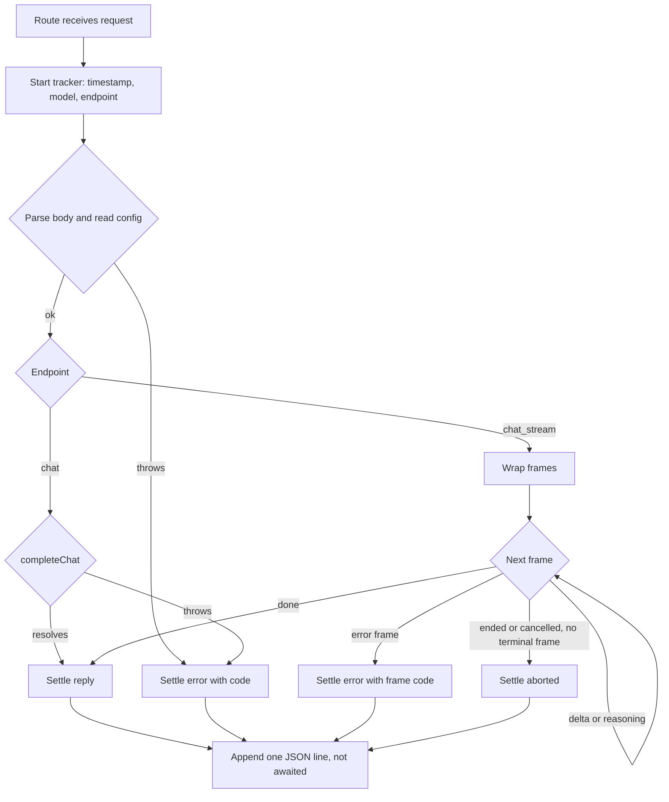

# Request Latency and Success Log - Plan

## Goal Capsule

- **Objective:** After any chat session, Filip can open one plain file and read how long each reply took, whether it succeeded, and which model produced it, so he can see what a module swap did to speed and reliability.
- **Means:** A framework-free recorder in the core that each chat endpoint starts once per request and settles once, appending one JSON line to a local file (KTD1, KTD2, KTD4).
- **Product authority:** Linear SPE-3, then this plan's Key Decisions, then `STRATEGY.md` (Key metrics, Instrumentation track, "no custom dashboards" boundary).
- **Implementation authority:** Product Contract wins on behavior; Planning Contract KTDs win on mechanism; Implementation Units override neither.
- **Stop conditions:** Stop and ask if recording a request would require changing a response body, status, or stream frame, or awaiting the log write before replying.
- **Execution profile:** Local single-developer change on a Next.js 16 app, stacked on the `feat/markdown-math-messages` branch; no deployment, no migrations.
- **Finisher:** `ce-work` (or Filip) implements and verifies; Filip runs the live check with his own OpenRouter key.

---

## Product Contract

### Summary

Every request to `POST /api/chat` and `POST /api/chat/stream` adds one line to a local JSON-lines log with its start time, duration, outcome, error type, endpoint, and model. Recording lives in one core module, never alters or delays the reply, and stores no message content.

### Problem Frame

`STRATEGY.md` names latency and success rate as key metrics "recorded by the API", and the Instrumentation track exists to turn "swap a module" into "see how it changed the system."
Today the API records nothing: a request leaves no trace beyond the 500-path `console.error` in `src/app/api/chat/http.ts`.
Without a per-request record, comparing two models or two agent loops comes down to feel.
The streaming endpoint that SPE-3 called "future" shipped with SPE-2/SPE-4, so both endpoints need coverage now.

### Key Decisions

- **Message content stays out of the log; sidebar conversation history is SPE-22, built on SPE-15's memory brick.** (session-settled: user-directed — chosen over folding history into SPE-3 and over browser-stored history: the log is append-only metrics and cannot serve list/reopen/continue, and storing conversations belongs to the memory brick.) Governs R3.
- **Both chat endpoints are covered now.** (session-settled: user-approved — chosen over covering only the complete-reply endpoint as SPE-3 was written: the streaming endpoint already exists and is the one the web chat uses.) Governs R1, R6.
- **A cancelled stream is its own `aborted` outcome, not an error.** (session-settled: user-approved — chosen over counting cancellations as errors: Filip's own cancellations would otherwise drag the success rate down.) Governs R4.
- **Requests that fail before the model is called are still logged as errors, with the model field empty only when no model is configured.** (session-settled: user-approved — chosen over skipping pre-model failures: SPE-3 requires missing-key and validation failures to count.) Governs R4, R5.
- **The log is a gitignored file in the repo by default, relocatable by an environment variable, and a failed write never affects the request.** (session-settled: user-approved — chosen over a fixed location and over failing the request: matches the local-first boundary and SPE-3's "never blocks the reply".) Governs R7, R8.

### Requirements

**What gets recorded**

- R1. Every request to `POST /api/chat` or `POST /api/chat/stream` produces exactly one log entry.
- R2. Each entry carries the request's start timestamp, its duration until the reply completed or failed, its outcome, its endpoint, and the configured model.
- R3. Entries contain no message content, provider error text, or API keys.
- R4. The outcome is `reply` for a completed reply, `error` for any failure, and `aborted` for a stream the client stopped before it finished.
- R5. Error entries carry the error type: `invalid_request`, `not_configured`, `provider_error`, or `internal_error`.

**How it is recorded**

- R6. Recording lives in one core module that both endpoints, and any future endpoint, use without duplicating timing or outcome logic.
- R7. Logging never changes the status, body, headers, or frames the caller receives, and never delays them.
- R8. Entries are plain JSON lines in a local file that Python, the GUI, or third-party tools can read, and nothing in the API depends on how they are visualized.

### Success Criteria

- After a session, a one-line `jq` or Python expression over the log file yields median latency and success rate per model, with aborted requests excluded from both.

### Scope Boundaries

- Dashboards, charts, or any reader or analyzer of the log.
- Cost or token tracking; cost is read from the OpenRouter dashboard per `STRATEGY.md`.
- The experiment log (SPE-8).
- Log rotation or size caps — considered and not built: each entry is roughly 150 bytes, so years of evening sessions stay small; revisit if the file passes tens of megabytes.
- Provider error messages in entries — considered and not built: the error type is enough for success rate, and messages vary in length and may echo request details; revisit when debugging from the log becomes a real need.
- Detecting client disconnects on the complete-reply endpoint — considered and not built: `completeChat` does not observe `request.signal` today, so such a request is logged when the model finishes; revisit if that endpoint gains cancellation.

#### Deferred to Follow-Up Work

- Conversation history in the web chat sidebar: SPE-22, blocked by SPE-15.
- Agent step and tool-call logging: SPE-11, which can reuse this plan's line writer.
- Fixed prompt set for before/after swap comparisons: SPE-21, which reads this log.

---

## Planning Contract

### Key Technical Decisions

- KTD1. **One framework-free recorder in `src/core/instrumentation/request-log.ts`; routes start it once and settle it once.** A request tracker records the start time and configured model when created and writes its entry on the first settle (reply, error, or aborted), ignoring later settles, which is what guarantees exactly one entry. Error classification, timing, and writing all live in the module, so a route adds only a start call and a settle in its success and catch paths. Recording in `src/proxy.ts` was rejected because proxy cannot see when a stream ends and would tie instrumentation to Next.js. Next's `after()` was rejected for the same coupling reason (`CONCEPTS.md`: the Core depends on no web framework). Governs R1, R6.
- KTD2. **Entry format is one JSON object per line with fixed field names.** Fields: `timestamp` (ISO 8601 UTC request start), `endpoint` (`chat` or `chat_stream`), `model` (string or `null`), `outcome` (`reply`, `error`, `aborted`), `errorCode` (present only when `outcome` is `error`), `durationMs` (integer). This is stored data that later tools read, so the names are fixed now rather than left to implementation. Governs R2, R4, R5, R8.
- KTD3. **The streaming outcome is read from the frames by a wrapping generator.** The wrapper passes every frame through unchanged and settles on the terminal frame: `done` settles `reply`, an `error` frame settles `error` with that frame's code, and the generator ending or being cancelled without a terminal frame settles `aborted`. A throw from the inner generator settles `error` with `internal_error` and rethrows. Duration ends at the terminal frame. `delta` and `reasoning` frames (the latter exists on the stacked branch) never settle. Any future streaming endpoint wraps its frames the same way. Governs R4, R6.
- KTD4. **The write is an asynchronous append that the request never awaits, and a failure only reaches the server console.** The writer creates the log's directory on demand and appends one line. A rejected write is caught and reported with `console.error`, so a broken path does not silently drop all metrics, and it never becomes an unhandled rejection or a response change. Single-line appends to a file opened in append mode keep concurrent requests from interleaving within a line. Governs R7, R8.
- KTD5. **The model field comes from `SPEKTER_MODEL`, read leniently at request start.** A non-throwing reader in `src/core/config.ts` returns the trimmed model id or `null`, so validation errors still carry the model when one is configured, and a missing model leaves `null`. This is the same value `readConfig` hands to the model brick for that request. Governs R2, R5.
- KTD6. **The log path is `SPEKTER_REQUEST_LOG`, defaulting to `logs/requests.jsonl` under the working directory, read per request.** Per-request reads follow the SPE-1 config convention and let tests point each run at a temp file. `/logs` is added to `.gitignore`. Governs R8.
- KTD7. **Entries record the endpoint.** Streamed and complete-reply latencies measure different things, because a stream's duration includes delivery to the client, so mixing them would skew any comparison. Governs R2.

### High-Level Technical Design

Directional sketch of how a request settles its single entry; not an implementation specification.

### Sequencing

U1 then U2 then U3; U4 can land with U3.
The work stacks on `feat/markdown-math-messages`, whose uncommitted changes add the `reasoning` stream frame. Those changes should be committed before this work starts so the two diffs stay separable.

---

## Implementation Units

### U1. Request tracker and JSON-lines writer

- **Goal:** A core module that times one request, classifies how it ended, and appends one entry to the log without blocking or throwing.
- **Requirements:** R1, R2, R3, R5, R7, R8
- **Dependencies:** None
- **Files:**
  - `src/core/instrumentation/request-log.ts` (new)
  - `src/core/instrumentation/request-log.test.ts` (new)
  - `src/core/config.ts`
  - `src/core/config.test.ts`
- **Approach:**
  1. Add the lenient configured-model reader to `src/core/config.ts` (KTD5).
  2. Define the entry shape from KTD2 and a tracker created per request with its endpoint; it captures the timestamp, a monotonic start, and the model at creation (KTD1).
  3. Settling with an error maps a `SpekterError` to its `code` and anything else to `internal_error` (R5); only the first settle writes (KTD1).
  4. The default writer resolves the path per KTD6 and appends per KTD4. Clock and writer are injectable so unit tests stay deterministic and off disk.
- **Patterns to follow:** `src/core/config.ts` for env-with-default reads; `src/core/errors.ts` for the error codes; the core's no-Next-import rule from the SPE-1 plan (KTD1 there).
- **Test scenarios:**
  - Settling with reply writes one entry with `outcome: "reply"`, no `errorCode`, the endpoint, the model, an ISO timestamp, and the duration from the injected clock.
  - Settling with an `InvalidRequestError`, a `NotConfiguredError`, or a `ProviderError` writes `outcome: "error"` with the matching `errorCode`.
  - Settling with a plain `Error` writes `errorCode: "internal_error"`.
  - Settling twice (reply, then error) writes only the first entry.
  - Settling as aborted writes `outcome: "aborted"` with no `errorCode`.
  - With `SPEKTER_MODEL` unset or blank, the entry's `model` is `null`.
  - The default writer appends one newline-terminated JSON line to a temp-dir path given by `SPEKTER_REQUEST_LOG`, creating missing parent directories.
  - Two settles from separate trackers produce two complete, separately parseable lines.
  - When the path cannot be written (for example, it is an existing directory), settling does not throw and `console.error` is called once.
  - The lenient model reader returns the trimmed id when set and `null` when unset or whitespace.
- **Verification:** The module imports nothing from `next`, and its tests pass without touching the repo's `logs/` directory.

### U2. Stream outcome wrapper

- **Goal:** A generator wrapper that settles a tracker from the stream's frames while passing them through untouched.
- **Requirements:** R1, R4, R6, R7
- **Dependencies:** U1
- **Files:**
  - `src/core/instrumentation/request-log.ts`
  - `src/core/instrumentation/request-log.test.ts`
- **Approach:** Settle per KTD3. Settle `aborted` in the wrapper's cleanup path when nothing settled earlier, so both natural end and consumer cancellation reach it.
- **Patterns to follow:** `streamChat` in `src/core/chat/stream.ts` for the frame union; the cancellation test in `src/app/api/chat/stream/route.test.ts` for driving `return()` mid-stream.
- **Test scenarios:**
  - Delta frames, then `done`: every frame comes out unchanged and in order, and one `reply` entry is written.
  - Delta, then an `error` frame with `provider_error`: frames pass through, and one `error` entry with `provider_error` is written.
  - A `reasoning` frame followed by `done`: the reasoning frame does not settle, and the entry is `reply`.
  - The consumer calls `return()` after the first delta: one `aborted` entry is written.
  - The inner generator ends with no terminal frame: one `aborted` entry is written.
  - The inner generator throws: one `error` entry with `internal_error` is written and the throw propagates.
- **Verification:** Frame output of the wrapped generator is identical to the unwrapped one in every scenario.

### U3. Wire both chat endpoints

- **Goal:** Both routes record every request, including failures before the model call, with no change to their HTTP contracts.
- **Requirements:** R1, R4, R5, R7
- **Dependencies:** U1, U2
- **Files:**
  - `src/app/api/chat/route.ts`
  - `src/app/api/chat/stream/route.ts`
  - `src/app/api/chat/route.test.ts`
  - `src/app/api/chat/stream/route.test.ts`
- **Approach:**
  1. Each route starts a tracker as its first step, before reading the body (KTD1).
  2. `POST /api/chat` settles reply after `completeChat` resolves and settles error in its catch, before `errorResponse`.
  3. `POST /api/chat/stream` settles error in its catch for pre-stream failures and wraps the `streamChat` frames with U2 before building the body.
  4. Route tests point `SPEKTER_REQUEST_LOG` at a per-test temp file in `beforeEach`, so no test writes into the repo.
- **Execution note:** Add the log assertions to the existing route tests first; every existing response assertion must keep passing unchanged, which is the proof of R7.
- **Patterns to follow:** The existing `beforeEach` env stubbing and mocked `createOpenRouterModel` in both route test files.
- **Test scenarios:**
  - `POST /api/chat` success: response unchanged, and the log holds one `reply` entry with `endpoint: "chat"` and `model: "openai/gpt-test"`.
  - `POST /api/chat` with the API key missing: 503 unchanged, one `error` entry with `not_configured` and the configured model.
  - `POST /api/chat` with an empty conversation: 400 unchanged, one `error` entry with `invalid_request`.
  - `POST /api/chat` when the provider fails: 502 unchanged, one `error` entry with `provider_error`.
  - `POST /api/chat` when model creation throws unexpectedly: 500 unchanged, one `error` entry with `internal_error`.
  - `POST /api/chat/stream` success: frames unchanged, one `reply` entry with `endpoint: "chat_stream"`.
  - `POST /api/chat/stream` with a mid-stream provider error: frames unchanged, one `error` entry with `provider_error`.
  - `POST /api/chat/stream` with the client aborting after the first delta: one `aborted` entry.
  - `POST /api/chat/stream` with `SPEKTER_MODEL` unset: 503 unchanged, one `error` entry with `model: null`.
  - With `SPEKTER_REQUEST_LOG` pointing at an unwritable path, `POST /api/chat` still returns the normal 200 reply.
  - Message content from the request appears nowhere in the log file.
- **Verification:** The full suite passes, and each request scenario leaves exactly one line in its temp log.

### U4. Configuration and docs

- **Goal:** The log location is discoverable and stays out of git.
- **Requirements:** R8
- **Dependencies:** U1
- **Files:**
  - `.gitignore`
  - `.env.example`
  - `README.md`
- **Approach:**
  1. Add `/logs` to `.gitignore` (KTD6).
  2. Add a commented `SPEKTER_REQUEST_LOG` entry to `.env.example` naming the default.
  3. Add a short README section describing the entry fields from KTD2 and one example `jq` query for success rate.
- **Test expectation:** none -- configuration and documentation only.
- **Verification:** After a live request, `git status` does not list `logs/`.

---

## Verification Contract

| Gate | Command or check | Proves |
|---|---|---|
| Unit and route tests | `npm test` | U1–U3 scenarios, and unchanged HTTP contracts |
| Lint | `npm run lint` | Repo style |
| Types | `npx tsc --noEmit` | Entry and tracker types line up with the routes |
| Live check | With `npm run dev`, send one complete-reply request and one streamed request with `curl`, stop one stream mid-reply, then inspect `logs/requests.jsonl` | One line per request with `reply`, `reply`, `aborted`, and real durations |
| Live failure check | Repeat a request with `OPENROUTER_API_KEY` blank | One `error` line with `not_configured` |

---

## Definition of Done

- R1–R8 hold, proven by the U1–U3 tests and the live check.
- No route response, status, header, or frame changed; existing route assertions pass untouched.
- `src/core/instrumentation/` imports nothing from `next`.
- No test writes to the repo's `logs/` directory.
- Abandoned-attempt code and debugging output are removed from the diff.
